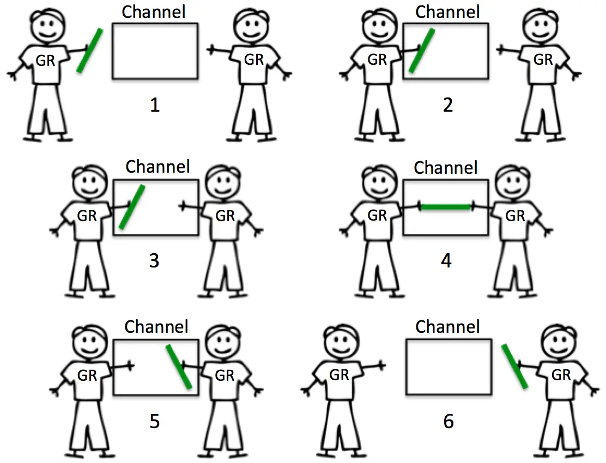
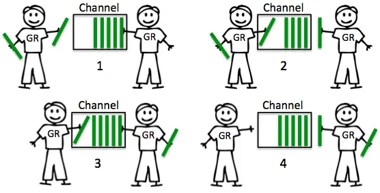
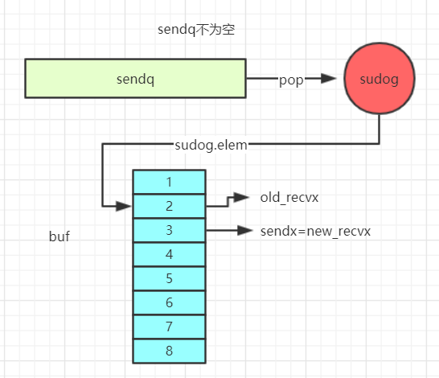
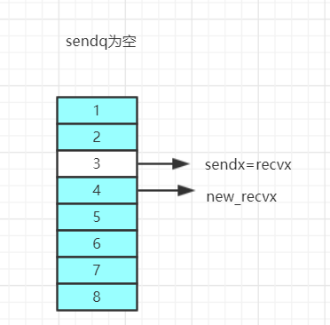

## channel

#### 简介

熟悉Go的人都知道，它提倡着不要通过共享内存来通讯，而要通过通讯来共享内存。Go提供了一种独特的并发同步技术来实现通过通讯来共享内存，此技术即为通道。我们可以把一个通道看作是在一个程序内部的一个FIFO数据队列。 一些协程可以向此通道发送数据，另外一些协程可以从此通道接收数据。


#### Example
介绍一下简单的用法：
```go
func main() {
	c := make(chan int)
	go func() {
		c <- 1
	}()
	t := <-c
	fmt.Println(t)
}
```
几个注意点（后面会一一验证）：

1. 向一个nil通道中发送一个值，将会永久阻塞。
2. 向一个已关闭的通道中发送一个值，将会导致panic。
3. 可以从关闭的通道中读取值，缓冲区为空时，读取的是通道类型的零值。
4. 重复关闭一个通道也会导致panic。
5. 通道的元素值的传递都是复制过程，且至少被复制过一次以上。（直接复制到receiver中经过一次复制，通过缓冲区的话则经历了两次复制）


#### channel有两种类型，Unbuffered channels与Buffered channels

##### Unbuffered channels
```go
	c:=make(chan int)
```
它是一个阻塞型channel，必须要receiver也准备好的情况下，sender才能够将消息投递到c中去。可以结合下图进行思考一波：



##### Buffered channels
```go
	c:=make(chan int,1)
```
在buf未满之前，它是一个非阻塞型channel，sender可以将符合channel类型的值投递到channel中去，它内部会自己维护一个队列。当buf满了之后，sender会阻塞。可以结合下图进行思考一波：



#### 几种应用模式

##### for-range

```go
func forRange() {
	c := make(chan int, 5)
	for i := 1; i <= 5; i++ {
		c <- i
	}
	close(c)
	for v := range c {
		fmt.Println(v)
	}
}
```

1. 在进行for-range一个通道时，该循环将源源不断的从通道中获取数据，直到此通道关闭并且它的缓冲队列中为空为止。
2. 这里的通道一定不能是单向发送通道（`chan <- int`）。
3. 当for-range一个空通道时，将会永久阻塞

##### select-case

```go
func selectCase() {
	c := make(chan int, 1)
	c <- 1
	close(c)
	select {
	case <-c:
		fmt.Println("xxxx")
	default:
		fmt.Println("aaaa")
	}
}
```

1. 每个`case`关键字后必须跟随一个通道接收数据操作或者一个通道发送数据操作。

2. 所有的非阻塞`case`操作中将有一个被随机选择执行（而不是按照从上到下的顺序），然后执行此操作对应的`case`分支代码块。

3. 在所有的`case`操作均为阻塞的情况下，如果`default`分支存在，则`default`分支代码块将得到执行； 否则，当前协程将被推入所有阻塞操作中相关的通道的发送数据协程队列或者接收数据协程队列中，并进入阻塞状态。

   

#### 源码分析

首先了解下channel是怎么创建的？

```go
func main() {
    c := make(chan int, 1)//line: 9
    close(c) //line: 10
}
```

通过`go tool compile -N -l -S main.go`输出其汇编代码，截取一小段观察一下：

```go
0x0024 00036 (main.go:9)        LEAQ    type.chan int(SB), AX // 将&chantype（元素类型是int）放到AX寄存器中
0x002b 00043 (main.go:9)        PCDATA  $2, $0
0x002b 00043 (main.go:9)        MOVQ    AX, (SP) // 也就是将&chantype放到SP（0）位置
0x002f 00047 (main.go:9)        MOVQ    $1, 8(SP)// 将1放到SP（8）位置
0x0038 00056 (main.go:9)        CALL    runtime.makechan(SB)// makechan(SP0,SP8)
0x003d 00061 (main.go:9)        PCDATA  $2, $1
0x003d 00061 (main.go:9)        MOVQ    16(SP), AX
0x0042 00066 (main.go:9)        MOVQ    AX, "".c+24(SP)
0x0047 00071 (main.go:10)       PCDATA  $2, $0
0x0047 00071 (main.go:10)       MOVQ    AX, (SP)
0x004b 00075 (main.go:10)       CALL    runtime.closechan(SB)
```

在上面的流程的关键部分加上了注释，也就是说咱们的`make(chan int, 1)`最终调用到了`runtime.makechan`这个方法。在进入分析之前先看看channel的结构：

```go
type hchan struct {
	qcount   uint           // 队列中实际有多少个元素
	dataqsiz uint           // channel的总长度（缓冲区的总长度）
	buf      unsafe.Pointer // 指向底层元素的指针
	elemsize uint16  // 元素类型的size
	closed   uint32  // 是否关闭，0：未关闭， 1：已关闭
	elemtype *_type // 元素类型
	sendx    uint   // 发送位置索引
	recvx    uint   // 接收位置索引
	recvq    waitq  // 接收者队列，一个双向链表
	sendq    waitq  // 发送者队列，一个双向链表

	lock mutex  // 锁，并发发送的时候需要上锁
}
```

咱们可以将`hchan`中的`buf`简单的看成一个数组缓冲区，`qcount`是数组中实际存储元素的数量，`dataqsiz`是数组的容量，`elemtype`是数组元素的类型。`sendx`和`recvx`分别是发送索引位置和接收索引位置，每次操作都会自增1，当`sendx`和`recv`等于`dataqsiz`时，会重置为零。`recvq`和`sendq`都是双向链表，里面维护着等待接收和等待发送的`goroutine`。当多个`gouroutine`并发操作同一个`channel`时，会使用`lock`进行控制。

##### 创建流程

```go
func makechan(t *chantype, size int) *hchan {
	elem := t.elem

	// 缓冲区中元素类型的尺寸不能超过16k
	if elem.size >= 1<<16 {
		throw("makechan: invalid channel element type")
	}
    // 判断是否位数对齐，
	if hchanSize%maxAlign != 0 || elem.align > maxAlign {
		throw("makechan: bad alignment")
	}
	// 计算缓冲区的总长度，并判断是否溢出
	mem, overflow := math.MulUintptr(elem.size, uintptr(size))
	if overflow || mem > maxAlloc-hchanSize || size < 0 {
		panic(plainError("makechan: size out of range"))
	}
	var c *hchan
	switch {
	case mem == 0:
		// channel长度或者元素类型尺寸为0时，也就是缓冲区长度为0时，只用分配hchan所占用的内存空间。
		c = (*hchan)(mallocgc(hchanSize, nil, true))
		// Race detector uses this location for synchronization.
		c.buf = c.raceaddr()
	case elem.kind&kindNoPointers != 0:
		// 元素类型不是指针类型，则将hchan和buf一次性分配出来
		c = (*hchan)(mallocgc(hchanSize+mem, nil, true))
        // 缓冲区buf的指针位置在c+hchanSize（hchanSize补齐为8的倍数）
		c.buf = add(unsafe.Pointer(c), hchanSize,hchanSize补齐为8的倍数)
	default:
		// 元素类型是指针类型，hchan和缓冲区单独分配
		c = new(hchan)
		c.buf = mallocgc(mem, elem, true)
	}
	// 元素的尺寸
	c.elemsize = uint16(elem.size)
	c.elemtype = elem
	c.dataqsiz = uint(size)


	return c
}
```

创建channel时共分为三种情况：

1. 缓冲区大小为0的情况下，只用给`hchan`分配内存即可。
2. 当元素类型不为指针时，可以考虑分配一段连续的内存，这样方便垃圾回收。
3. 当元素类型为指针时，需要给`hchan`和`buf`分别开辟空间。

最终都调用到`mallocgc`方法进行内存的分配，分配过程这里不做过多的描述，后面会考虑写一篇文章介绍一下分配的相关流程。


##### 发送流程

```go
func main() {
	c := make(chan int, 1)
	c <- 1 // line:9
	close(c) //line:10
}
```

通过`go tool compile -N -l -S main.go`输出其汇编代码，截取一小段观察一下：

```go
0x0057 00087 (main.go:9)        CALL    runtime.chansend1(SB)
0x005c 00092 (main.go:10)       PCDATA  $2, $1
0x005c 00092 (main.go:10)       PCDATA  $0, $0
0x005c 00092 (main.go:10)       MOVQ    "".c+24(SP), AX
0x0061 00097 (main.go:10)       PCDATA  $2, $0
0x0061 00097 (main.go:10)       MOVQ    AX, (SP)
0x0065 00101 (main.go:10)       CALL    runtime.closechan(SB)
```

从上面的汇编代码可以清晰的看到，`c<-1`就是一个简单的语法糖，实际上底层调用的是`runtime.chansend1`方法，咱们跟踪一下这个方法：

```go
// entry point for c <- x from compiled code
//go:nosplit
func chansend1(c *hchan, elem unsafe.Pointer) {
	chansend(c, elem, true, getcallerpc())
}
```

从上面的注释

> entry point for c <- x from compiled code

也可以看出来，这段代码是`c <- x `编译后的一个切入点。接着看下一个调用栈：

```go
func chansend(c *hchan, ep unsafe.Pointer, block bool, callerpc uintptr) bool {
	if c == nil {
		if !block {
			return false
		}
        // 从这里可以观察到，向一个nil的channel中发送一个值将会导致永久阻塞
		gopark(nil, nil, waitReasonChanSendNilChan, traceEvGoStop, 2)
		throw("unreachable")
	}

	if debugChan {
		print("chansend: chan=", c, "\n")
	}

	if raceenabled {
		racereadpc(c.raceaddr(), callerpc, funcPC(chansend))
	}
	// 通过chansend1方法调用是不会进入这个条件语句的，在非阻塞并且通道未关闭
    // 的情况下，满足 ①该channel是unbufferedChannel且接收队列为空 ②该channel是bufferedChannel
    // 且缓冲区已满。 这两个条件中任意一个条件就可以快速返回false。表示投递失败
	if !block && c.closed == 0 && ((c.dataqsiz == 0 && c.recvq.first == nil) ||
		(c.dataqsiz > 0 && c.qcount == c.dataqsiz)) {
		return false
	}

	var t0 int64
	if blockprofilerate > 0 {
		t0 = cputicks()
	}
	// 进行上锁，防止出现并发问题
	lock(&c.lock)

	if c.closed != 0 {
        // 通道已经关闭，解锁的同时panic,这也证实了向一个已经关闭的通道发送值会导致panic
		unlock(&c.lock)
		panic(plainError("send on closed channel"))
	}

	if sg := c.recvq.dequeue(); sg != nil {
        // 从等待接收的队列链表中取出一个接收者，进行值的拷贝
		send(c, sg, ep, func() { unlock(&c.lock) }, 3)
		return true
	}

	if c.qcount < c.dataqsiz {
		// 当该通道时bufferedChannel时，缓冲区还未满的情况下，从缓冲区中取出一个内存块
		qp := chanbuf(c, c.sendx)
		if raceenabled {
			raceacquire(qp)
			racerelease(qp)
		}
        // 将发送值拷贝到上面取出的内存块上面去
		typedmemmove(c.elemtype, qp, ep)
        // 发送索引自增1
		c.sendx++
		if c.sendx == c.dataqsiz {
            // 复用缓冲区，当索引位到缓冲区最后一位时，置位0
			c.sendx = 0
		}
        // 缓冲区中存储的元素自增1
		c.qcount++
		unlock(&c.lock)
		return true
	}

	if !block {
		unlock(&c.lock)
		return false
	}

	// 获取当前goroutine
	gp := getg()
    // 从当前goroutine所在的p上获取一个sudog结构体
	mysg := acquireSudog()
	mysg.releasetime = 0
	if t0 != 0 {
		mysg.releasetime = -1
	}
	// 将要发送的值赋值给sudog的elem字段，后面chanrecv会用到
	mysg.elem = ep
	mysg.waitlink = nil
	mysg.g = gp
	mysg.isSelect = false
	mysg.c = c
	gp.waiting = mysg
	gp.param = nil
    // 将mysg插入到发送队列的尾部
	c.sendq.enqueue(mysg)
    // 进行channel的解锁，并且将当前goroutine置为waiting状态。
	goparkunlock(&c.lock, waitReasonChanSend, traceEvGoBlockSend, 3)
	// 这里进行保活一下，防止接受者还没有拷贝过去，这个值就已经被gc给回收了
	KeepAlive(ep)

	// someone woke us up.
	if mysg != gp.waiting {
		throw("G waiting list is corrupted")
	}
	gp.waiting = nil
	if gp.param == nil {
		if c.closed == 0 {
			throw("chansend: spurious wakeup")
		}
		panic(plainError("send on closed channel"))
	}
	gp.param = nil
	if mysg.releasetime > 0 {
		blockevent(mysg.releasetime-t0, 2)
	}
	mysg.c = nil
    // 将当前使用的sudog放到空闲池中，供下一次使用
	releaseSudog(mysg)
	return true
}
```

从上面的流程中，咱们也验证了使用时需要注意的两个点：

1. 向一个空的`channel`中发送值将会导致永远阻塞。
2. 向一个已关闭的`channel`中发送值将会导致panic。

咱们可以将上述流程简单的总结为三个段：

###### 接收队列不为空

```go
if sg := c.recvq.dequeue(); sg != nil {
		send(c, sg, ep, func() { unlock(&c.lock) }, 3)
		return true
}
// 常用的链表操作手段，取出队列中的第一个元素
func (q *waitq) dequeue() *sudog {
	for {
		sgp := q.first
		if sgp == nil {
			return nil
		}
		y := sgp.next
		if y == nil {
			q.first = nil
			q.last = nil
		} else {
			y.prev = nil
			q.first = y
			sgp.next = nil // mark as removed (see dequeueSudog)
		}

		....

		return sgp
	}
}

func send(c *hchan, sg *sudog, ep unsafe.Pointer, unlockf func(), skip int) {
	....
	if sg.elem != nil {
        // 将sp,也就是发送值拷贝到sg.elem字段中
		sendDirect(c.elemtype, sg, ep)
		sg.elem = nil
	}
	....
    // 唤醒当前接收的goroutine
	goready(gp, skip+1)
}
```

第一步：从接收队列中取出第一个sudog元素。

第二步：将发送的值拷贝到sudog的elem字段上。

第三步：唤醒与当前sudog绑定的处于waiting状态的goroutine。

这个情况下，发送值只经过了一次拷贝，就被接收者消费掉了。


###### 缓冲区还有可用的位置

```go
if c.qcount < c.dataqsiz {
    qp := chanbuf(c, c.sendx)
    if raceenabled {
        raceacquire(qp)
        racerelease(qp)
    }
    typedmemmove(c.elemtype, qp, ep)
    c.sendx++
    if c.sendx == c.dataqsiz {
        c.sendx = 0
    }
    c.qcount++
    unlock(&c.lock)
    return true
}
```

这个情况下，发送值会先进行一次拷贝到缓冲区中。然后在有接收者的情况下，会从缓冲去再拷贝一次，拷贝到接收者指定的内存地址上。在这个过程中，会先通过`qp := chanbuf(c, c.sendx)`方法取出缓冲区下一个可用的内存块，然后通过`typedmemmove(c.elemtype, qp, ep)`方法将值拷贝到相应的内存块中去。最后增加相应的索引位和缓冲区元素的个数。这里在满足条件的情况下会对索引位进行重置，进入下一个轮回。

###### 阻塞发送

```go
...
mysg := acquireSudog()
...
c.sendq.enqueue(mysg)
goparkunlock(&c.lock, waitReasonChanSend, traceEvGoBlockSend, 3)
...
```


在不满足上面两个条件的情况下，当前goroutine会保存部分信息到channel的发送者队列中，并且通过调用`goparkunlock`阻塞当前goroutine，直到有接收者消费掉了保存该goroutine的`sudog`，并调用`goready`方法，才会使当前陷入`waiting`状态的goroutine被重新唤醒。


##### 接收流程

```go
func main() {
	c := make(chan int, 1)
	close(c)
    <-c //line: 10
}
```

通过`go tool compile -N -l -S main.go`输出其汇编代码，截取一小段观察一下：

```go
0x0055 00085 (main.go:10)       MOVQ    AX, (SP)
0x0059 00089 (main.go:10)       MOVQ    $0, 8(SP)
0x0062 00098 (main.go:10)       CALL    runtime.chanrecv1(SB)
0x0067 00103 (main.go:11)       MOVQ    32(SP), BP
0x006c 00108 (main.go:11)       ADDQ    $40, SP
```

实际上在第10行会触发`runtime.chanrecv1`方法，和上面的发送一样，也是个语法糖：

```go
// entry points for <- c from compiled code
func chanrecv1(c *hchan, elem unsafe.Pointer) {
	chanrecv(c, elem, true)
}
```

这个方法有两个参数，一个是`hchan`指针，另一个是一个地址值，后面会将从通道中取出来的值复制到该地址值中去。接下来看一下核心的`chanrecv`方法，for-range包括select-case最终都会调用到这个方法。

```go
func chanrecv(c *hchan, ep unsafe.Pointer, block bool) (selected, received bool) {
	if debugChan {
		print("chanrecv: chan=", c, "\n")
	}

	if c == nil {
		if !block {
			return
		}
        // 从一个nil通道中读取一个值也会被永远的阻塞
		gopark(nil, nil, waitReasonChanReceiveNilChan, traceEvGoStop, 2)
		throw("unreachable")
	}

	// 通过chanrecv1调用是不会进入这个代码块的，在非阻塞的情况下，如果通道长度为0并且发送队列为空，
    // 或者通道长度大于0并且缓冲区中没有元素并且通道未关闭的情况下，进行快速返回
	if !block && (c.dataqsiz == 0 && c.sendq.first == nil ||
		c.dataqsiz > 0 && atomic.Loaduint(&c.qcount) == 0) &&
		atomic.Load(&c.closed) == 0 {
		return
	}

	var t0 int64
	if blockprofilerate > 0 {
		t0 = cputicks()
	}
	// 进行上锁
	lock(&c.lock)

	if c.closed != 0 && c.qcount == 0 {
        // 通道已经关闭，并且缓冲区已经空了，返回该元素类型的零值
		if raceenabled {
			raceacquire(c.raceaddr())
		}
		unlock(&c.lock)
		if ep != nil {
			typedmemclr(c.elemtype, ep)
		}
		return true, false
	}

	if sg := c.sendq.dequeue(); sg != nil {
		// 在发送队列不为空的情况下，取出一个sender，如果是unbufferedChannel，则直接从sender中拷贝
        // 一个值到接收者；如果是一个bufferedChannel,从缓冲队列的recvx处取一个值，并且将sender中的
        // 值拷贝到recvx索引的位置
		recv(c, sg, ep, func() { unlock(&c.lock) }, 3)
		return true, true
	}

	if c.qcount > 0 {
		// 直接从缓冲区中取出对应recvx索引位置的值
		qp := chanbuf(c, c.recvx)
		if raceenabled {
			raceacquire(qp)
			racerelease(qp)
		}
       
		if ep != nil {
            // 拷贝qp中的值到指定的地址ep中
			typedmemmove(c.elemtype, ep, qp)
		}
        // 将qp中的元素值清空成零值
		typedmemclr(c.elemtype, qp)
        // 接收索引进行自增
		c.recvx++
		if c.recvx == c.dataqsiz {
			c.recvx = 0
		}
        // 缓冲区元素长度递减
		c.qcount--
		unlock(&c.lock)
		return true, true
	}

	if !block {
		unlock(&c.lock)
		return false, false
	}

	// 发送队列为空，并且缓存区中也没有值，后续流程将会阻塞当前goroutine
	gp := getg()
    // 从当前g绑定的p中获取一个sudog(这一块是从一个缓存队列中获取)
	mysg := acquireSudog()
	mysg.releasetime = 0
	if t0 != 0 {
		mysg.releasetime = -1
	}

	mysg.elem = ep
	mysg.waitlink = nil
	gp.waiting = mysg
	mysg.g = gp
	mysg.isSelect = false
	mysg.c = c
	gp.param = nil
    // 将mysg放到接收队列的尾部
	c.recvq.enqueue(mysg)
    // 将当前goroutine状态变为waiting,并且解开channel的锁
	goparkunlock(&c.lock, waitReasonChanReceive, traceEvGoBlockRecv, 3)

	// someone woke us up
	if mysg != gp.waiting {
		throw("G waiting list is corrupted")
	}
	gp.waiting = nil
	if mysg.releasetime > 0 {
		blockevent(mysg.releasetime-t0, 2)
	}
	closed := gp.param == nil
	gp.param = nil
	mysg.c = nil
    // 释放sudog（重新丢到p对应的缓存队列中）
	releaseSudog(mysg)
	return true, !closed
}
```

接收流程和发送流程类似，可大概归结为四个段：

###### 通道关闭且缓冲区为0

```go
if c.closed != 0 && c.qcount == 0 {
    if raceenabled {
        raceacquire(c.raceaddr())
    }
    unlock(&c.lock)
    if ep != nil {
        typedmemclr(c.elemtype, ep)
    }
    return true, false
}
```

上述代码将直接返回一个对应元素类型的零值，分配对应元素零值的代码` typedmemclr(c.elemtype, ep)`，感兴趣的可以自己追踪一下。

###### 发送队列不为空

这一块可能和发送流程有点区别：

```go
if sg := c.sendq.dequeue(); sg != nil {
    // 能进这里代表要么缓冲队列满了，要么该通道是一个无缓冲通道
    recv(c, sg, ep, func() { unlock(&c.lock) }, 3)
    return true, true
}

func recv(c *hchan, sg *sudog, ep unsafe.Pointer, unlockf func(), skip int) {
	if c.dataqsiz == 0 {
        // 代表这个通道是一个无缓冲通道
		if raceenabled {
			racesync(c, sg)
		}
		if ep != nil {
			// 直接从sender中拷贝值
			recvDirect(c.elemtype, sg, ep)
		}
	} else {
        // 从缓冲区中直接取出recvx索引位置的值
		qp := chanbuf(c, c.recvx)
		if raceenabled {
			raceacquire(qp)
			racerelease(qp)
			raceacquireg(sg.g, qp)
			racereleaseg(sg.g, qp)
		}
		// 拷贝缓冲区中的值到指定的ep地址上
		if ep != nil {
			typedmemmove(c.elemtype, ep, qp)
		}
		// 这里多了一步流程，会将sender中的值存放到刚刚recvx位置处
		typedmemmove(c.elemtype, qp, sg.elem)
		c.recvx++
		if c.recvx == c.dataqsiz {
			c.recvx = 0
		}
		c.sendx = c.recvx // c.sendx = (c.sendx+1) % c.dataqsiz
	}
	sg.elem = nil
	gp := sg.g
	unlockf()
	gp.param = unsafe.Pointer(sg)
	if sg.releasetime != 0 {
		sg.releasetime = cputicks()
	}
    // 唤醒当前sender的goroutine
	goready(gp, skip+1)
}
```

这里会分两种情况进行考虑：

1. 通道是unbuffered channel，则直接拷贝从发送队列中取出来的值。
2. 通道是buffered channel，则拷贝从缓冲区中取出响应的值，并且需要将发送队列中取出来的值拷贝到对应缓冲区的位置上。



在缓冲区是满的情况下，sendx和recvx指向同一个位置。例如上图：咱们取出recvx为2处的元素，然后会将sudog中的值拷贝到2位置处，同时sendx和recvx都指向3位置。

3. 最终唤醒与当前sender sudog绑定的goroutine。

###### 缓冲区不为空

```go
if c.qcount > 0 {
    // 读取缓冲区recvx索引处的值
    qp := chanbuf(c, c.recvx)
    if raceenabled {
        raceacquire(qp)
        racerelease(qp)
    }
    if ep != nil {
        // 将上述的值拷贝到指定的地址ep中
        typedmemmove(c.elemtype, ep, qp)
    }
    // 将recvx处的值置位零值
    typedmemclr(c.elemtype, qp)
    c.recvx++
    if c.recvx == c.dataqsiz {
        c.recvx = 0
    }
    c.qcount--
    unlock(&c.lock)
    return true, true
}
```

直接从缓冲区中读取recvx索引位置中的值，将其拷贝大指定的指针中，然后将对应recvx处置位零值。



如上图所示，取出索引位置为3的元素后，将其置位零值，发送者下次填充buf时就可以从index=3的位置开始填充。

###### 阻塞接收

流程和上述的阻塞发送流程一致，不做过多介绍。


##### 关闭

简单的看一段代码

```go
func main() {
    c := make(chan int)// line：9
	close(c) //line：10
}
```

通过`go tool compile -N -l -S main.go`输出其汇编代码，截取一小段观察一下：

```go
  0x0038 00056 (main.go:9)        CALL    runtime.makechan(SB)
  0x003d 00061 (main.go:9)        PCDATA  $2, $1
  0x003d 00061 (main.go:9)        MOVQ    16(SP), AX //将makechan返回的结果放到AX寄存器
  0x0042 00066 (main.go:9)        MOVQ    AX, "".c+24(SP)
  0x0047 00071 (main.go:10)       PCDATA  $2, $0
  0x0047 00071 (main.go:10)       MOVQ    AX, (SP) //将AX寄存器中的值复制到SP（0）位置
  0x004b 00075 (main.go:10)       CALL    runtime.closechan(SB) //调用runtime.closechan方法
```

从上面的汇编代码可以看出来，通道的关闭最终调用到了`runtime.closechan`这个方法。

```go
func closechan(c *hchan) {
    // 关闭一个空的channel将会导致panic
	if c == nil {
		panic(plainError("close of nil channel"))
	}

	lock(&c.lock)
	if c.closed != 0 {
        // 关闭一个已关闭的channel也会导致panic
		unlock(&c.lock)
		panic(plainError("close of closed channel"))
	}

	if raceenabled {
		callerpc := getcallerpc()
		racewritepc(c.raceaddr(), callerpc, funcPC(closechan))
		racerelease(c.raceaddr())
	}
	// 将closed置位1，表示当前通道已关闭
	c.closed = 1

	var glist gList

	// 取出所有接收队列中的元素，将其加入到一个单向链表中
	for {
		sg := c.recvq.dequeue()
		if sg == nil {
			break
		}
		if sg.elem != nil {
			typedmemclr(c.elemtype, sg.elem)
			sg.elem = nil
		}
		if sg.releasetime != 0 {
			sg.releasetime = cputicks()
		}
		gp := sg.g
		gp.param = nil
		if raceenabled {
			raceacquireg(gp, c.raceaddr())
		}
		glist.push(gp)
	}

	// 取出所有发送队列中的元素，将其加入到一个单向链表中
	for {
		sg := c.sendq.dequeue()
		if sg == nil {
			break
		}
		sg.elem = nil
		if sg.releasetime != 0 {
			sg.releasetime = cputicks()
		}
		gp := sg.g
		gp.param = nil
		if raceenabled {
			raceacquireg(gp, c.raceaddr())
		}
		glist.push(gp)
	}
	unlock(&c.lock)

	// 唤醒阻塞的goroutine
	for !glist.empty() {
		gp := glist.pop()
		gp.schedlink = 0
		goready(gp, 3)
	}
}
```

关闭通道这一块理解起来不太难，最开始对空channel和已关闭的channel做了panic处理，后面进行资源的释放。因为处于发送队列和接收队列的goroutine都是阻塞状态的，咱们在关闭这个通道时必须得将这些goroutine都唤醒，防止goroutine泄露。


##### select-go流程

###### 单case分支（包含一个default）

```go
func main() {
	c := make(chan int)
	close(c)
	select {
        case <-c://line: 11
	default:
	}
}
```

使用上面的编译指令生成汇编代码如下（截取部分）：

```go
0x0050 00080 (main.go:11)       MOVQ    $0, (SP)
0x0058 00088 (main.go:11)       PCDATA  $2, $1
0x0058 00088 (main.go:11)       PCDATA  $0, $0
0x0058 00088 (main.go:11)       MOVQ    "".c+24(SP), AX
0x005d 00093 (main.go:11)       PCDATA  $2, $0
0x005d 00093 (main.go:11)       MOVQ    AX, 8(SP)
0x0062 00098 (main.go:11)       CALL    runtime.selectnbrecv(SB)
```

跟踪一下调用链：

```go
func selectnbrecv(elem unsafe.Pointer, c *hchan) (selected bool) {
    // 这里不会进行阻塞，因为这里默认有个default分支，c中无法取出值的情况下默认执行default分支即可
    // 具体实现流程参考上面的接收流程
	selected, _ = chanrecv(c, elem, false)
	return
}
```

###### 单case分支（不包含default）

```go
func main() {
	c := make(chan int)
	close(c)
	select {
	case <-c:
	}
}
```

使用上面的编译指令生成汇编代码如下（截取部分）：

```go
0x005a 00090 (main.go:11)       MOVQ    "".c+24(SP), AX
0x005f 00095 (main.go:11)       PCDATA  $2, $0
0x005f 00095 (main.go:11)       MOVQ    AX, (SP)
0x0063 00099 (main.go:11)       MOVQ    $0, 8(SP)
0x006c 00108 (main.go:11)       CALL    runtime.chanrecv1(SB)
```

跟踪一下调用链：

```go
func chanrecv1(c *hchan, elem unsafe.Pointer) {
    // 在从通道无法取出值的情况下，会进行阻塞当前goroutine，等待被唤醒
    // 具体实现流程参考上面的接收流程
	chanrecv(c, elem, true)
}
```


###### 多case分支

```go
func main() {
	c := make(chan int)
	a := make(chan int)
	close(c)
	close(a)
    select { //line: 13
	case <-c:
	case <-a:
	default:

	}
}
```

使用上面的编译指令生成汇编代码如下（截取部分）：

```go
0x011d 00285 (main.go:13)       MOVQ    AX, (SP)
0x0121 00289 (main.go:13)       PCDATA  $2, $1
0x0121 00289 (main.go:13)       PCDATA  $0, $0
0x0121 00289 (main.go:13)       MOVQ    ""..autotmp_7+88(SP), AX
0x0126 00294 (main.go:13)       PCDATA  $2, $0
0x0126 00294 (main.go:13)       MOVQ    AX, 8(SP)
0x012b 00299 (main.go:13)       MOVQ    $3, 16(SP) // 表示case长度为3（包括default分支）
0x0134 00308 (main.go:13)       CALL    runtime.selectgo(SB)
```

跟踪一下调用链：

```go
func selectgo(cas0 *scase, order0 *uint16, ncases int) (int, bool) {
	cas1 := (*[1 << 16]scase)(unsafe.Pointer(cas0))
	order1 := (*[1 << 17]uint16)(unsafe.Pointer(order0))

	scases := cas1[:ncases:ncases]
	pollorder := order1[:ncases:ncases]
	lockorder := order1[ncases:][:ncases:ncases]

	for i := range scases {
		cas := &scases[i]
		if cas.c == nil && cas.kind != caseDefault {
			*cas = scase{}
		}
	}
	for i := 1; i < ncases; i++ {
		j := fastrandn(uint32(i + 1))
		pollorder[i] = pollorder[j]
		pollorder[j] = uint16(i)
	}


	for i := 0; i < ncases; i++ {
		j := i
		c := scases[pollorder[i]].c
		for j > 0 && scases[lockorder[(j-1)/2]].c.sortkey() < c.sortkey() {
			k := (j - 1) / 2
			lockorder[j] = lockorder[k]
			j = k
		}
		lockorder[j] = pollorder[i]
	}
	for i := ncases - 1; i >= 0; i-- {
		o := lockorder[i]
		c := scases[o].c
		lockorder[i] = lockorder[0]
		j := 0
		for {
			k := j*2 + 1
			if k >= i {
				break
			}
			if k+1 < i && scases[lockorder[k]].c.sortkey() < scases[lockorder[k+1]].c.sortkey() {
				k++
			}
			if c.sortkey() < scases[lockorder[k]].c.sortkey() {
				lockorder[j] = lockorder[k]
				j = k
				continue
			}
			break
		}
		lockorder[j] = o
	}
	// lock all the channels involved in the select
	sellock(scases, lockorder)

	var (
		gp     *g
		sg     *sudog
		c      *hchan
		k      *scase
		sglist *sudog
		sgnext *sudog
		qp     unsafe.Pointer
		nextp  **sudog
	)

loop:
	// pass 1 - look for something already waiting
	var dfli int
	var dfl *scase
	var casi int
	var cas *scase
	var recvOK bool
	for i := 0; i < ncases; i++ {
		casi = int(pollorder[i])
		cas = &scases[casi]
		c = cas.c

		switch cas.kind {
		case caseNil:
			continue

		case caseRecv:
			sg = c.sendq.dequeue()
			if sg != nil {
				goto recv
			}
			if c.qcount > 0 {
				goto bufrecv
			}
			if c.closed != 0 {
				goto rclose
			}

		case caseSend:
			if raceenabled {
				racereadpc(c.raceaddr(), cas.pc, chansendpc)
			}
			if c.closed != 0 {
				goto sclose
			}
			sg = c.recvq.dequeue()
			if sg != nil {
				goto send
			}
			if c.qcount < c.dataqsiz {
				goto bufsend
			}

		case caseDefault:
			dfli = casi
			dfl = cas
		}
	}

	if dfl != nil {
		selunlock(scases, lockorder)
		casi = dfli
		cas = dfl
		goto retc
	}

	// pass 2 - enqueue on all chans
	gp = getg()
	if gp.waiting != nil {
		throw("gp.waiting != nil")
	}
	nextp = &gp.waiting
	for _, casei := range lockorder {
		casi = int(casei)
		cas = &scases[casi]
		if cas.kind == caseNil {
			continue
		}
		c = cas.c
		sg := acquireSudog()
		sg.g = gp
		sg.isSelect = true
		// No stack splits between assigning elem and enqueuing
		// sg on gp.waiting where copystack can find it.
		sg.elem = cas.elem
		sg.releasetime = 0
		if t0 != 0 {
			sg.releasetime = -1
		}
		sg.c = c
		// Construct waiting list in lock order.
		*nextp = sg
		nextp = &sg.waitlink

		switch cas.kind {
		case caseRecv:
			c.recvq.enqueue(sg)

		case caseSend:
			c.sendq.enqueue(sg)
		}
	}

	// wait for someone to wake us up
	gp.param = nil
	gopark(selparkcommit, nil, waitReasonSelect, traceEvGoBlockSelect, 1)

	sellock(scases, lockorder)

	gp.selectDone = 0
	sg = (*sudog)(gp.param)
	gp.param = nil

	casi = -1
	cas = nil
	sglist = gp.waiting
	// Clear all elem before unlinking from gp.waiting.
	for sg1 := gp.waiting; sg1 != nil; sg1 = sg1.waitlink {
		sg1.isSelect = false
		sg1.elem = nil
		sg1.c = nil
	}
	gp.waiting = nil

	for _, casei := range lockorder {
		k = &scases[casei]
		if k.kind == caseNil {
			continue
		}
		if sglist.releasetime > 0 {
			k.releasetime = sglist.releasetime
		}
		if sg == sglist {
			// sg has already been dequeued by the G that woke us up.
			casi = int(casei)
			cas = k
		} else {
			c = k.c
			if k.kind == caseSend {
				c.sendq.dequeueSudoG(sglist)
			} else {
				c.recvq.dequeueSudoG(sglist)
			}
		}
		sgnext = sglist.waitlink
		sglist.waitlink = nil
		releaseSudog(sglist)
		sglist = sgnext
	}

	if cas == nil {
		
		goto loop
	}

	c = cas.c

	if cas.kind == caseRecv {
		recvOK = true
	}

	selunlock(scases, lockorder)
	goto retc

bufrecv:
	// can receive from buffer
	if raceenabled {
		if cas.elem != nil {
			raceWriteObjectPC(c.elemtype, cas.elem, cas.pc, chanrecvpc)
		}
		raceacquire(chanbuf(c, c.recvx))
		racerelease(chanbuf(c, c.recvx))
	}
	if msanenabled && cas.elem != nil {
		msanwrite(cas.elem, c.elemtype.size)
	}
	recvOK = true
	qp = chanbuf(c, c.recvx)
	if cas.elem != nil {
		typedmemmove(c.elemtype, cas.elem, qp)
	}
	typedmemclr(c.elemtype, qp)
	c.recvx++
	if c.recvx == c.dataqsiz {
		c.recvx = 0
	}
	c.qcount--
	selunlock(scases, lockorder)
	goto retc

bufsend:
	// can send to buffer
	....
	typedmemmove(c.elemtype, chanbuf(c, c.sendx), cas.elem)
	c.sendx++
	if c.sendx == c.dataqsiz {
		c.sendx = 0
	}
	c.qcount++
	selunlock(scases, lockorder)
	goto retc

recv:
	// can receive from sleeping sender (sg)
	recv(c, sg, cas.elem, func() { selunlock(scases, lockorder) }, 2)
	if debugSelect {
		print("syncrecv: cas0=", cas0, " c=", c, "\n")
	}
	recvOK = true
	goto retc

rclose:
	// read at end of closed channel
	selunlock(scases, lockorder)
	recvOK = false
	if cas.elem != nil {
		typedmemclr(c.elemtype, cas.elem)
	}
	goto retc

send:
	send(c, sg, cas.elem, func() { selunlock(scases, lockorder) }, 2)
	goto retc

retc:
	return casi, recvOK

sclose:
	// send on closed channel
	selunlock(scases, lockorder)
	panic(plainError("send on closed channel"))
}
```

